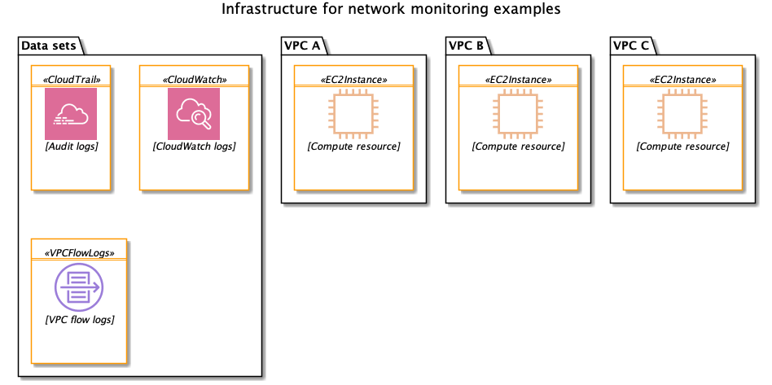
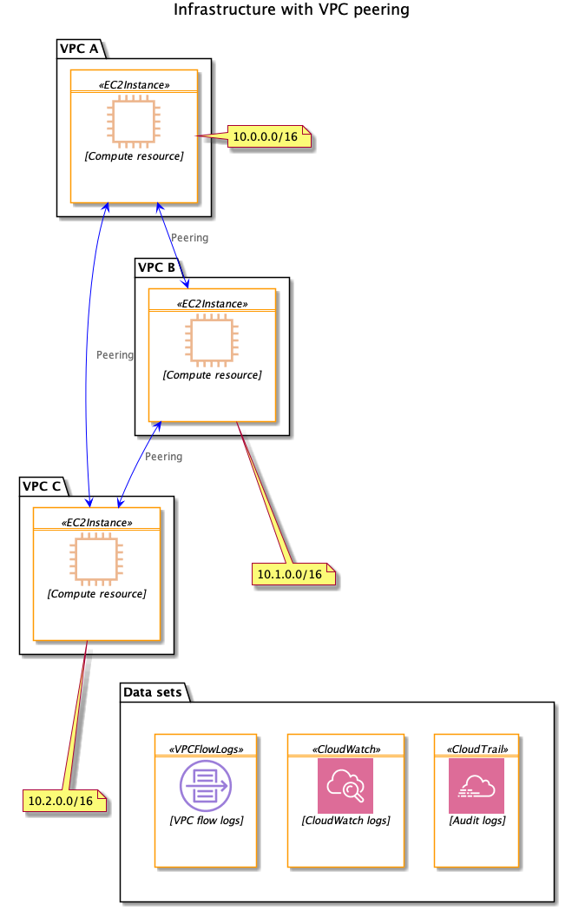
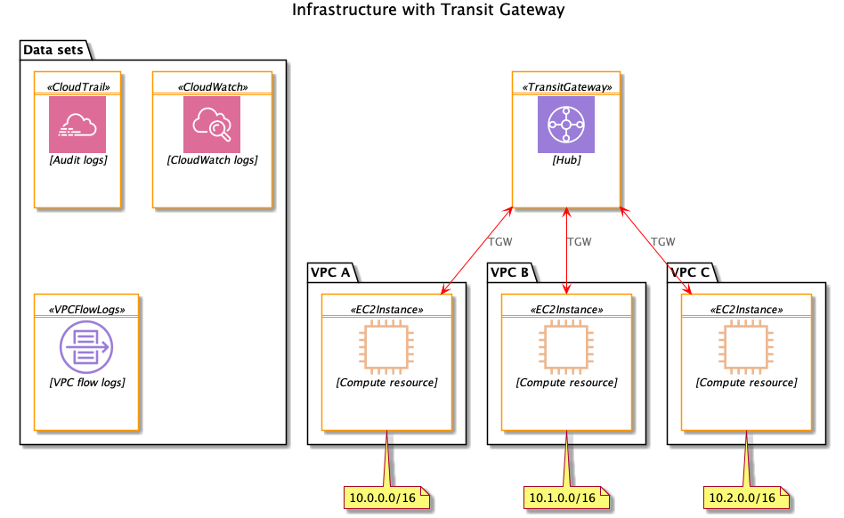

# Network monitoring

Copyright Amazon.com, Inc. or its affiliates. All Rights Reserved.
SPDX-License-Identifier: MIT-0

This project sets up a variety of monitoring and alerting for network traffic in and between VPCs.

We'll use the basic infrastructure shown below, with three VPCs and several logging systems turned on.

We'll start with the VPCs connected by peering relationships.  

Then we'll switch to using transit gateway.

We also create subnets in each VPC with secondary CIDRs to experiment with using that secondary CIDR for EKS.

## Data collection

We want to turn on data collection using these sources:

* CloudTrail (needs to be turned on as a prerequisite)
* CloudWatch (set up automatically)
* VPC flow logs (set up by Terraform)

## Alerting

### Goal

We will send an email alarm when we detect changes to a VPC route table affecting traffic outside of the VPC. 

### Implementation

First, we get a lot of built-in reporting through Config.  We can see the [configuration history](https://docs.aws.amazon.com/config/latest/developerguide/view-manage-resource-console.html) of a route table, including resources that the route table is related to, and 90 days of CloudTrail events related to the route table.

For specific alerts, we can use either of these approaches.

* Have Config send change notifications to SNS, forward them to SQS, and use a Lambda function to process them.
* Trigger a CloudWatch alarm from a CloudTrail event.

We'll use the second approach since it is more targeted.  We don't really need to have Config send every event to SQS if we're only interested in specific events.

## Reporting

We will create a dashboard that shows, per VPC:

* Total traffic
* Total ingress traffic
* Total egress traffic
* Total traffic to other VPCs

We'll use Athena to query the flow logs and prepare a QuickSight dashboard.

## Deployment

### Prerequisites

* Make sure that you have a CloudTrail trail [set up](https://docs.aws.amazon.com/awscloudtrail/latest/userguide/cloudtrail-create-and-update-a-trail.html).
* Enable [AWS Config](https://docs.aws.amazon.com/config/latest/developerguide/gs-console.html) for all resources

### Terraform

One time:

    tf init                             
    cd alerts
    pip install ipaddr -t .
    cd ..

Create a file called `local.tfvars` and set or override any of the Terraform variables.

Every change:

    ./scripts/zip-lambda.sh
    tf apply -var-file="local.tfvars"

## Testing

### Alerts

* Subscribe your email to SNS topic
* Change a route table, making sure that the destination is a CIDR not in the VPC

### Reporting

After some data has been flowing for a while, go to Athena and define the partitions for the most recent days.  For example, assuming we have data from April 20:

    ALTER TABLE flowlogsa
    ADD PARTITION (dt='2020-04-02')
    location 's3://<BucketA>/AWSLogs/<Acct>/vpcflowlogs/<region>/2020/04/02';

Repeat this for all 3 tables.  For a production use case, we would have a Lambda function create partitions automatically as new objects land in S3.

Now we set up QuickSight manually, since there's no Terraform or CloudFormation support for making dashboards.

* Enable QuickSight in your account.
* Add a new data set.
    * Data set source is Athena
    * Choose the `flowlogs` database
    * Choose the table for the VPC of interest
    * Add a calculated field to convert `starttime` into a regular date
* Prepare analysis
    * All visuals use `numbytes` grouped by `StartDate` hour
    * Total ingress/egress are filtered by the current VPC's CIDR
    * Traffic to other VPCs is filtered by the other VPC's CIDR

We can potentially use the QuickSight CLI to create templates for programmatic deployment.
